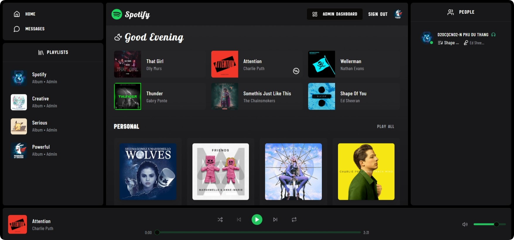

# SPOTIFY CLONE WEB APPLICATION



<p align="justify">
    <em>
        Spotify is meticulously crafted with a focus on modernity and user convenience, faithfully replicating the core features of the original Spotify. This innovative application delivers a fresh approach to the music player experience, enabling users to effortlessly stream music and engage in live conversations. With an intuitive interface and streamlined functionality, Spotify enhances the social aspect of music listening, making it simpler than ever for users to connect and share with people. Additionally, its integrated real-time chat feature for messaging transforms the platform into a space not only for enjoying music but also for fostering meaningful connections.
    </em>
</p>

## 1. PROJECT

```
git clone https://github.com/BIN-PDT/WEBAPP_SPOTIFY.git && rm -rf WEBAPP_SPOTIFY/.git
```

_For privacy reasons, follow the format of `.env.example` and replace the sensitive information in `.env` with your own._

-   _Register MongoDB Atlas or MongoDB Compass to obtain `DATABASE_URI` for backend_.

-   _Register Clerk to obtain `SECRET_KEY` & `PUBLISHABLE_KEY` for backend and frontend_.

## 2. DEPENDENCY

```
npm install --prefix backend
```

```
npm install --prefix frontend
```

## 3. RUN APPLICATION

```
npm run dev --prefix backend
```

```
npm run dev --prefix frontend
```
